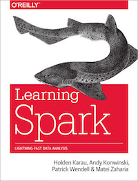
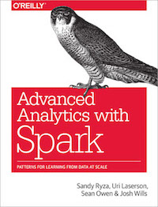

# Code repository for O'reilly course : 'Integrating Hadoop and Spark'


 ## Getting Started
You can clone this repository as follows
```
    $   git   clone   git@github.com:elephantscale/hadoop-spark.git
```


## Lab Order
1. [Dev environment setup](dev-env-setup/README.md)
2. [Hadoop setup](hadoop-setup/README.md)
3. [Spark Shell](spark-shell/README.md)
4. [RDDs](rdd/README.md)
5. [Dataframes](dataframe/README.md)
6. [Hive and Spark](hive-spark/README.md)
7. [Spark and YARN](spark-yarn/README.md)
8. [Spark Applications](spark-app/README.md)

## Resources
### Books
* ["Learning Spark"](http://shop.oreilly.com/product/0636920028512.do)
* ["Advanced Analytics With Spark"](http://shop.oreilly.com/product/0636920035091.do)
* ["Mastering Apache Spark"](https://www.gitbook.com/book/jaceklaskowski/mastering-apache-spark/details) (free online book) by Jacek Laskowski

<a href="http://shop.oreilly.com/product/0636920028512.do"></a>
<a href="http://shop.oreilly.com/product/0636920035091.do"></a>


### Sites
* [Hadoop Weekly](https://www.hadoopweekly.com/) - weekly digest of Big Data news and tech articles
* [Apache Spark](http://spark.apache.org/)
* [Spark mailing lists](http://spark.apache.org/community.html)

### Vendors
* [Cloudera](http://cloudera.com)
* [Hortonworks](http://hortonworks.com)
* [MapR](http://mapr.com)
* [Databricks](http://databricks.com)